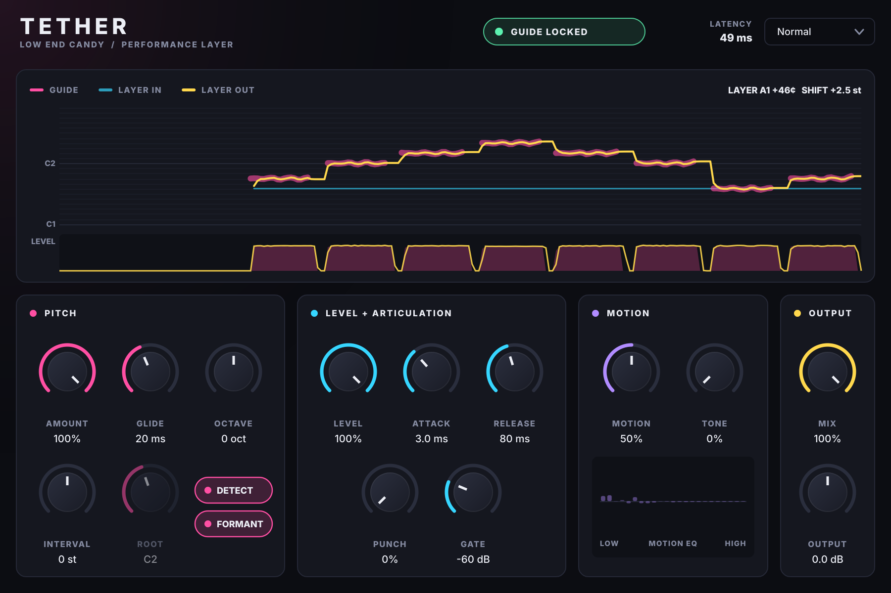

# Tether

**Tether a layer to a guide sound.** Put Tether on the sound you want to layer and
send it the sound it should follow through the sidechain. The layer then plays
the guide's **notes** (vibrato and slides included), matches its **volume**, and
picks up its **articulation** and tonal **movement**. The result is a layer that
moves as one with the lead.



## How it works

| Stage | What happens |
|---|---|
| **Pitch** | Detects the guide's pitch and the layer's own pitch, then pitch-shifts the layer onto the guide's pitch curve. The shifter is a peak-locked phase vocoder that keeps stereo intact, with optional formant preservation. |
| **Level** | Measures both loudness curves and replaces the layer's with the guide's (100% = identical loudness curve). |
| **Articulation** | **Gate** mutes the layer between the guide's notes. **Punch** re-applies the guide's transients. |
| **Motion** | Compares the guide's and the layer's spectra in about 25 bands and moves the layer's tone the way the guide's moves (filter sweeps, vowels, brightness), without changing its loudness. **Tone** also pulls the layer's average tone toward the guide. |

Everything is latency-compensated. The guide, the processed layer and the dry signal stay sample-aligned, and the latency is reported to the DAW.

## Install

Builds for macOS (Universal VST3 + AU) and Windows (VST3) are produced by GitHub
Actions on every change:

1. Open the repo's **Actions** tab, open the latest **Tether plugin** run and download **Tether-macOS** or **Tether-Windows**.
2. Unzip it and follow `INSTALL.txt`. On a Mac: right-click `install-mac.command` and choose **Open**.
3. Rescan plug-ins in your DAW.

The macOS build is ad-hoc signed but not notarized yet. The install script clears
the download quarantine so DAWs will load it.

## Routing the guide (sidechain)

Put Tether on the **layer** track, then send the **guide** into Tether's sidechain input:

| DAW | How |
|---|---|
| Ableton Live | In Tether's device, open the sidechain section, switch it on, and choose the guide track under *Audio From*. |
| Logic Pro | Use the **Side Chain** menu in the top-right of Tether's plug-in window. |
| FL Studio | Select the guide's mixer track, right-click the send arrow on Tether's track and choose *Sidechain to this track*. Then point Tether's sidechain input at it in the wrapper's *Processing* tab. |
| Bitwig | Use the sidechain selector in Tether's device header. |
| Studio One | Click **Side-Chain** in Tether's window header and add a send from the guide track to it. |
| Cubase | Enable side-chain in Tether's window and add a send from the guide track to *Tether - Side-Chain*. |
| Reaper | Give the layer track 4 channels and send the guide to channels 3/4. |

The header says **GUIDE LOCKED** once Tether hears the guide. Until a sidechain is
connected, the layer passes through untouched.

## Controls

**Pitch**
- **Amount**: how far the layer's pitch moves onto the guide's (100% = exactly the guide's pitch).
- **Glide**: smooths pitch changes. Raise it for slides, or to calm down heavily filtered guides.
- **Octave / Interval**: put the layer octaves or semitones away from the guide (e.g. Octave -1, Interval +7).
- **Detect / Root**: Detect finds the layer's own pitch. Turn it off and set **Root** for noisy or unpitched layers, or ones you know the note of. Root is also the fallback when nothing can be detected.
- **Formant**: keeps the layer's character when it's shifted far (no chipmunk or monster effect).

**Level + Articulation**
- **Level**: how closely the layer's loudness follows the guide.
- **Attack / Release**: how fast the layer follows the guide getting louder or quieter.
- **Punch**: adds the guide's transients to the layer.
- **Gate**: mutes the layer when the guide drops below this level (Off at -80 dB).

**Motion**
- **Motion**: copies the guide's tonal movement. The bar graph shows the moving EQ.
- **Tone**: matches the layer's overall tone to the guide.

**Output**
- **Mix**: processed vs untouched layer (phase-aligned, so any blend is safe).
- **Output**: output gain.
- **Resolution** (header): **Tight** gives the lowest latency (~25 ms) and tracks notes above ~90 Hz. **Normal** (~49 ms) goes down to ~45 Hz. **Deep** (~95 ms) handles sub bass down to ~25 Hz.

## Tips
- Guides should be **monophonic** (one note at a time): vocals, leads, bass lines. The layer can be anything.
- Sub or 808 guides: use **Deep**.
- Layer sounds odd an octave off: use **Octave**, or turn **Detect** off and set **Root**.
- Heavily filtered or wobbling guides can make the pitch jitter slightly. Add 50–150 ms of **Glide**.
- Tether follows in real time. It doesn't time-stretch the layer to fix timing, so keep the layer and guide on the same grid.

## Build from source

Requires CMake 3.22+ and a C++17 compiler (Xcode, Visual Studio 2022, GCC or Clang).
JUCE 8 is downloaded automatically.

```bash
cmake -S tether -B build -DCMAKE_BUILD_TYPE=Release
cmake --build build --config Release --parallel

# macOS universal binary:
cmake -S tether -B build -DCMAKE_BUILD_TYPE=Release -DCMAKE_OSX_ARCHITECTURES="arm64;x86_64"
```

Plug-ins end up in `build/Tether_artefacts/Release/{VST3,AU,Standalone}`. Add
`-DTETHER_COPY_AFTER_BUILD=ON` to install them into your plug-in folders
automatically.

On Linux you need the usual JUCE packages: `libasound2-dev libx11-dev libxrandr-dev
libxinerama-dev libxcursor-dev libxext-dev libfreetype-dev libfontconfig1-dev`.

### Tests
```bash
build/TetherTests_artefacts/Release/TetherTests
```
The tests cover pitch-detection accuracy (sine, saw and square waves from 27 Hz to
1.5 kHz), pitch-shift accuracy, level matching, gating, punch, motion, octave-error
guards at note onsets, bit-exact bypass, latency alignment, block-size invariance,
stereo coherence, NaN/runaway safety, bus layouts, state save/restore and the editor.
CI also runs [pluginval](https://github.com/Tracktion/pluginval) at strictness 10
and Apple's `auval`.

### Offline renderer
Process files without a DAW. The output is latency-compensated and lines up with
the inputs:
```bash
build/TetherRender_artefacts/Release/tether_render layer.wav guide.wav out.wav --octave -1 --motion 80
build/TetherRender_artefacts/Release/tether_render --demo demo   # renders synthesized before/after examples
```

## Code map
```
Source/dsp/PitchTracker     YIN pitch detection (FFT-based) + fundamental-phase refinement, pitch follower
Source/dsp/SpectralLayer    STFT: peak-locked pitch shift, formant envelope, motion/tone band EQ
Source/dsp/TetherEngine     framing, latency alignment, level/gate/punch, dry/wet
Source/PluginProcessor      JUCE plug-in: buses (main + "Guide" sidechain), parameters, state
Source/PluginEditor, ui/    custom UI: live pitch/level view, motion EQ meter
tests/                      unit tests (JUCE UnitTest)
tools/TetherRender.cpp      offline renderer and demo generator
```

## Licensing notes
- **JUCE** is dual-licensed (AGPLv3 or the commercial JUCE licence). Selling Tether
  closed-source requires a JUCE licence tier that matches your revenue.
- **Inter** (UI font) is under the SIL Open Font License. See `Resources/fonts/Inter-LICENSE.txt`.
